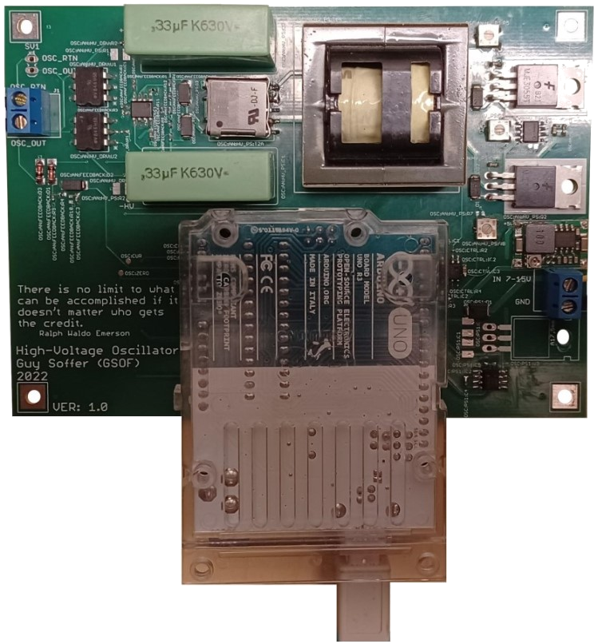
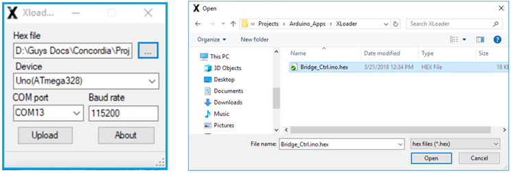
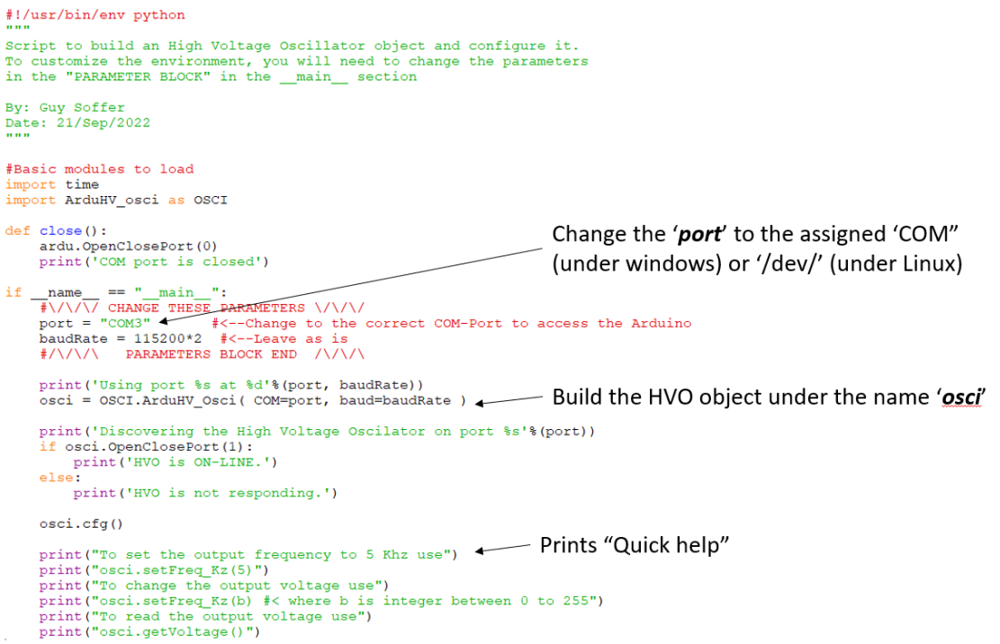

# Introduction
The Programable-High-Voltage-Oscilator (PHVO) is an expansion board for the Arduino Uno R3 to generate continous square ware signal between 10V to 400V at 1K to 15K Hz frequency.
The ArduHVP_osci is a python class designed program the PHVO to the desiered output signal.
The communication between the main computer and the PHVO is done over USB(RS232) and based on the GSOF_ArduBride module.

# Programable-High-Voltage-Oscilator hardware
The ArduShield includes a dual H-bridge capable of driving DC motors, Thermo Electric Coolers (TEC), and other high-power devices up to 12V / 2A.
In addition, the onboard 5V regulator eliminates the need to supply a precise voltage to drive the external peripherals and to prevent overloading the USB host.
    The ArduShield also includes connectors for easy connection of servos, analog sensors, General Input Output ports (GPIO), and devices over the Serial-Peripheral-Interface (SPI) or Inter-Integrated-Circuit I2C bus.
    Although the ArduShield can be used in various projects, it was initially designed to encapsulate the electronic circuits used in Digital-Microfluidics (DMF) setup. A unique feature of the shield is the capability to stack up additional extension boards (e.g., the Digital-Microfluidics (DMF) electrode driver) without the need for extra cables and workbench space. Another unique capability is its ability to measure the impedance between any DMF electrode and the Indium-Tin-Oxide (ITO) plate. This is extremely useful for detecting faults in droplets and estimating droplet size.
A short video demonstrating the HVO can be watch in the link below
https://www.youtube.com/watch?v=4fjpdIp5VfY

# Installation and hardware setup
The ArduBridge Python model is a pip package installation and the firmware that runs on the Arduino is installed by programming(also know as uploading).
## Firmware upload
To program the Arduino use the xloader application (https://github.com/xinabox/xLoader) and follow these steps:
1.	Open the xloader application.
2.	Select the COM port that the Arduino is connected to.
3.	Select the Hex file "HighVoltageOsci_Firmware.hex" (or the most updated FW you have).
4.	Press the "Upload" button and wait for the programming operation to finish after a few seconds.

## Python modules installation
Before installing the ArduShield module, make sure Python 3.7 or above is installed (https://www.python.org/) together with the latest pyserial module (use the command "pip install pyserial" to install it). 
Installation of the ArduBridge can be done in two ways:
1.	By double clicking the setup.bat batch file.
2.	By running the setup.py script in a command prompt ("CMD") window.

# Documentation and example code
A detailed [user manual](https://github.com/mrGSOF/arduBridge/blob/main/Documentation/HighVoltageOscilator_UM.pdf) can be found under the Documentation folder.
[Code example](https://github.com/mrGSOF/arduBridge/tree/main/Examples) are present under the Example folder.

Update the COM port in ArduBridge_IDE.py and run in interactive mode ("python -i ArduHV_osci_IDE.py")
You can interact the Arduino using the ardu and ards objects (refer to the [tutorial](https://github.com/mrGSOF/arduBridge/blob/main/Documentation/HighVoltageOscilator_UM.pdf) for further information).
